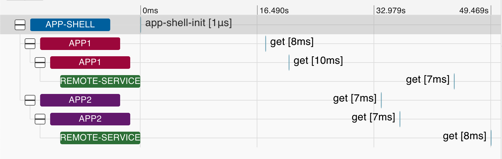

# Mashroom Portal Zipkin Page Enhancement

This page enhancement can be used in [Mashroom Portal](https://www.mashroom-server.com/documentation/docs/html/#mashroomportal)
when it is required to group spans created by multiple apps located
within one page to one common trace.

## Motivation

When app is configured to use [Zipkin fetch instrumentation](https://github.com/openzipkin/zipkin-js/tree/master/packages/zipkin-instrumentation-fetch),
each app has its own context and thus created its own trace

```
+------+
| APP1 |
+------+
   |
   +--------+
   | trace1 |
   +--------+
       |
       +---------+  +---------+  +---------+
       | span1-1 |--| span1-2 |--| span1-3 |
       +---------+  +---------+  +---------+

+------+
| APP2 |
+------+
   |
   +--------+
   | trace2 |
   +--------+
       |
       +---------+  +---------+  +---------+
       | span2-1 |--| span2-2 |--| span2-3 |
       +---------+  +---------+  +---------+


```

## Grouping spans coming from different apps together

With the Zipkin page enhancement activated and configured, all traces have common parent:



## Tagging same services

Due to independency during microfrontend development, each team might use its own naming convention for backend call.
This plugin allows to recognize and to mark backend calls of the same resource type.
When detected, it adds "__service.id" tag to the span

## Creating new trace

A new trace is always created when the page is loaded.
There is also possibility to create a new trace programmatically calling global `window.__resetTrace()` method.
Each time called - a new parent trace is created.

## Installation

    npm i -S mashroom-zipkin-page-enhancement

## Configuration

```
"defaultConfig": {
  "includeOnPages": ["/web/test1", "/web/"],
  "tracingEnabled": true,
  "tracerUrl": "http://localhost:9411/api/v2/spans",
  "servicePatterns": {
    "customer": "/*customer*/"
  }
}
```

* tracingEnabled - when set to false - no spans are grouped together
* traceUrl - Zipkin URL
* includeOnPages: list of pages, where span groping takes place
* servicePatterns - map of URL patterns to mark as a certain service
